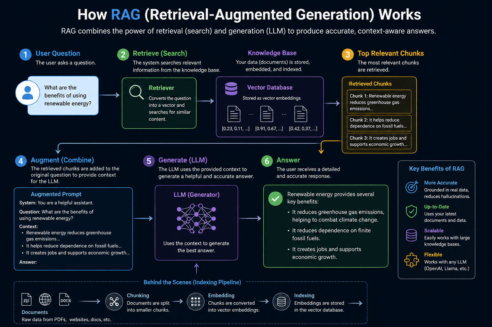

# 🎙️ AI Technical Interview Coach

A high-caliber technical interview practice platform built to simulate realistic software engineering interviews, evaluate technical answers across multi-dimensional criteria, and ground evaluations using **Retrieval-Augmented Generation (RAG)** and **Vector Embeddings**.

---

## 🧠 RAG & AI Architecture



The application uses an end-to-end **Retrieval-Augmented Generation (RAG)** pipeline to eliminate hallucinations and benchmark candidate responses against verified engineering documentation:

1. **Ingestion & Embedding**: Authoritative technical knowledge docs are embedded with `gemini-embedding-001` (3072 dimensions) and indexed in an in-memory `VectorStore`.
2. **Real-time Semantic Retrieval**: When a candidate submits an answer, the system computes **Cosine Similarity** to retrieve top matching reference chunks ($k=2$).
3. **Prompt Augmentation & Grounding**: The retrieved technical reference is injected into Gemini 3.6 Flash's prompt context with low temperature (`0.2`).
4. **Transparent Inspection**: Candidates can inspect the exact reference documents retrieved, similarity scores, and mathematical concept coverage directly in the evaluation UI.

---

## ✨ Features

- 🎯 **Topic & Difficulty Selection**: Practice across JavaScript, TypeScript, React, Next.js, Node.js, System Design, Databases, DSA, and Security at Junior, Mid, Senior, and Staff levels.
- 📐 **Semantic Concept Coverage**: Calculates mathematical cosine similarity between the candidate's answer and expected key concepts using vector embeddings.
- 📊 **4-Axis Evaluation Scorecard**: Granular scoring out of 10 for **Knowledge**, **Technical Accuracy**, **Clarity**, and **Completeness**.
- 💡 **Staff Engineer Model Answers**: Generates senior-level benchmark answers with code snippets and trade-off explanations.
- 🛠️ **Adaptive Question Generation**: Uses Gemini Tool Calling to inspect prior session history and adapt subsequent questions to test weak areas.

---

## 🛠️ Tech Stack

- **Framework**: [Next.js](https://nextjs.org/) (App Router, Turbopack, TypeScript)
- **Styling**: [Tailwind CSS](https://tailwindcss.com/) with modern dark-mode glassmorphism
- **AI Models & SDK**:
  - Google Gemini API (`@google/genai`)
  - `gemini-3.6-flash` (Question Generation & Grounded Evaluation)
  - `gemini-embedding-001` (Vector Embeddings & Semantic Search)
- **Validation**: [Zod](https://zod.dev/) for type-safe structured outputs

---

## 🚀 Getting Started

### 1. Prerequisites
- Node.js 18+
- A Google Gemini API Key ([Get one at Google AI Studio](https://aistudio.google.com/))

### 2. Installation
```bash
# Clone the repository
git clone <repo-url>
cd Ai_interviewer/my-app

# Install dependencies
npm install # or pnpm install
```

### 3. Environment Setup
Create a `.env.local` file in the `my-app` directory:
```env
GEMINI_API_KEY=your_actual_gemini_api_key_here
```

### 4. Run Locally
```bash
npm run dev
# or
pnpm dev
```

Open [http://localhost:3000](http://localhost:3000) in your browser to start practicing.

---

## 📜 Learning Milestones
- **Stage 1**: Gemini API client integration & configuration
- **Stage 2**: Role & rubric prompt engineering
- **Stage 3**: Structured JSON outputs & Zod schema validation
- **Stage 4**: Function calling / tool execution
- **Stage 5**: Vector embeddings & cosine similarity calculations
- **Stage 6**: In-memory vector database with metadata filtering
- **Stage 7**: Full Retrieval-Augmented Generation (RAG) pipeline
